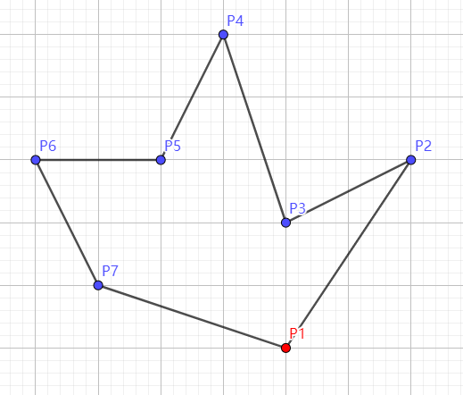
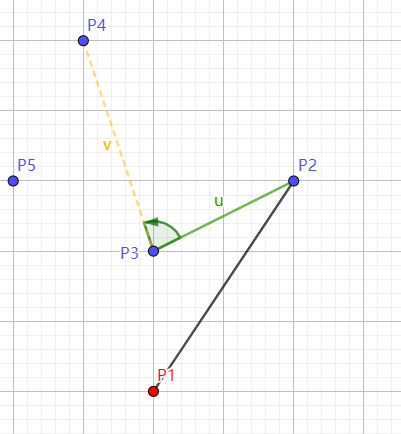
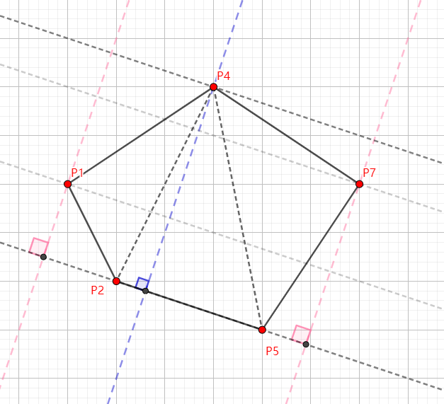
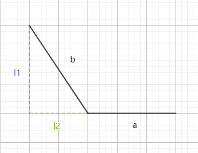
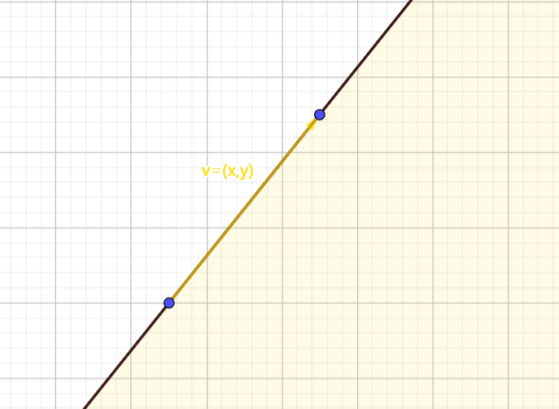

# 计算几何

## 概述

- 计算几何是OI中相对独立的一个板块，其题目一般情况下很难用其他算法去解决
- 一般会出现在省选难度及以上的比赛中，在NOIP等比赛中几乎没有出现过
- 理解难度相对不大
- 代码实现一般比较恶心，很多细节，堪比毒瘤数据结构
- 经常会被卡精度

**以下代码是可以通过模板题的，不过由于模板题的数据强度普遍不大，因此有可能代码中会存在一些错误，如果你觉得以下代码有误可以直接说** 

## 向量

向量是计算几何的基础，后续算法的实现基本都需要运用到向量的点积叉积等运算。

### 向量的定义

既有**大小**又有**方向**的量。

如果一条有向线段起点是 $A$ ，终点是 $B$ ，那么可以将其表示为  $\overrightarrow{AB}$ 或 $ \vec{a}$ 。

向量具有**平移不变性**，对于任意向量，都可以将其起点平移到原点位置，因此向量也可以由一对**有序实数对**表示，即当这个向量起点在原点时终点坐标 $(x,y)$ 。

向量**具有模长**，即向量的长度，表示为  $|\vec{a}|$ 。

对于 $ \vec{a}=(x,y)$ ，$ |\vec{a}|= \sqrt{x^2+y^2}$ 。

#### 相反向量

两个**大小相等方向相反**的向量互为相反向量。

即 $\vec{a}=(x,y)$ 的相反向量为 $-\vec{a}=(-x,-y)$ ，$|\vec{a}|=|-\vec{a}|$。

### 向量的四则运算

向量具有对另一向量的加减法以及对一实数的乘除法。

#### 加减法

将两个向量 $\vec{a},\vec{b}$ 相加相当于将向量 $\vec{b}$ 平移使其与 $\vec{a}$ 首尾相接。

因此对于 $\vec{a}=(x_1,y_1),\vec{b}=(x_2,y_2),$ 有 $\vec{a}+\vec{b}=(x_1+x_2,y_1+y_2)$ 。


而 $\vec{a}-\vec{b}$ 则相当于 $\vec{a}$ 加上 $\vec{b}$ 的相反向量，即 $\vec{a}+(-\vec{b})=(x_1-x_2,y_1-y_2)$。


```c++
node operator +(const node &now) const{return x+now.x,y+now.y;}
node operator -(const node &now) const{return x-now.x,y-now.y;}
```

#### 乘除法

向量的数乘即对向量进行放缩。设 $\vec{a}=(x,y),k \in\mathbb{R}$ ，有 $k\vec{a}=(kx,ky)$ 。

至于除法，则相当于乘一个分数。

```c++
node operator *(const double &now) const{return x*now,y*now;}
node operator /(const double &now) const{return x/now,y/now;}
```

### 向量的极角

向量的极角即为向量从 $(0,0)$ 出发，与 $x$ 轴正方向形成的夹角，可以使用 atan2(y,x) 函数求得。

该函数会返回一个 $(-\pi,\pi]$ 之间的数，表示极角大小（**可能会有精度误差**）。

### 向量的旋转

设 $\vec a=(x,y)$ ，倾角为 $\theta$ ，将其逆时针旋转 $\alpha$ 得到 $\vec{b}$ 。
$$
\begin{aligned}
&\cos \theta = \frac{x}{\sqrt{x^2+y^2}} ,\sin \theta = \frac{y}{\sqrt{x^2+y^2}} \\
&设\ r=\sqrt{x^2+y^2}\\
&\therefore \vec{a}=(x,y)=(r\cos \theta,r\sin \theta)\\
&\therefore \vec{b}=(r\cos(\theta +\alpha),r\sin(\theta +\alpha))\\
&\because \cos(\theta +\alpha)=\cos\theta\cos\alpha-\sin\theta\sin\alpha,\\
&\sin(\theta+\alpha)=\sin\theta\cos\alpha+\cos\theta\sin\alpha\\
&\begin{aligned}
\therefore \vec{b}&=(r(\cos\theta\cos\alpha-\sin\theta\sin\alpha),r(\sin\theta\cos\alpha+\cos\theta\sin\alpha))\\
&=(r\cos\theta\cos\alpha-r\sin\theta\sin\alpha,r\sin\theta\cos\alpha+r\cos\theta\sin\alpha)\\
&=(x\cos\alpha-y\sin\alpha,y\cos\alpha+x\sin\alpha)
\end{aligned}
\end{aligned}
$$


### 向量的点积和叉积

#### 点积

点积表示为 $\vec{a}\cdot\vec{b}$，其几何意义为 $\vec{a}$ 在 $\vec{b}$ 上的投影长度乘以 $|\vec{b}|$ ，即 $|\vec{a}||\vec{b}|\cos\theta$，其中 $\theta$ 为 $\vec{a}$ 与 $\vec{b}$ 的夹角。

（投影就是说在这个平面上垂直向下打一束光，最终形成的影子，即向量水平方向上的长度）


取两个向量 $\vec a$ 和  $\vec b$ 。 旋转坐标，使 $\vec b$ 水平，则它变成了 $(|\vec b|, 0)$ 。那么向量 $\vec a$ 有了新的坐标 $(a_1, a_2)$，我们得到：
$$
\begin{aligned}
&a_1=|\vec a|\cos\theta\\
&a_1 \cdot |\vec b|+a_2 \cdot 0=a_1 \cdot |\vec b|\\
&设 \vec a=(x_a,y_a),\vec b=(x_b,y_b)\\
&\begin{aligned}
\therefore \vec{a}\cdot\vec{b}&=|\vec a||\vec b|\cos\theta\\
&=\sqrt{x_a^2+y_a^2}\sqrt{x_b^2+y_b^2}\cos\theta\\
&=\sqrt{x_a^2+y_a^2}\sqrt{x_b^2+y_b^2}\cos(\theta_a-\theta_b)\\
&=\sqrt{x_a^2+y_a^2}\sqrt{x_b^2+y_b^2}(\cos\theta_a\cos\theta_b+\sin\theta_a\sin\theta_b)\\
&=\sqrt{x_a^2+y_a^2}\sqrt{x_b^2+y_b^2}(\frac{x_a\cdot x_b}{\sqrt{x_a^2+y_a^2}\sqrt{x_b^2+y_b^2}}+\frac{y_a\cdot y_b}{\sqrt{x_a^2+y_a^2}\sqrt{x_b^2+y_b^2}})\\
&=x_a\cdot x_b+y_a\cdot y_b
\end{aligned}
\end{aligned}
$$

```c++
double dot(node a,node b){ return x.a*x.b+y.a*y.b; }
```

##### 应用

- 如果两个向量同向（共线），那么它们的数量积为他们的模长之积。

- 如果两个向量夹角 $<90^\circ$ ，那么它们的数量积为正。
- 如果两个向量夹角 $=90^\circ$ ，那么他们的数量积为 $0$ ，因为 $\cos 90^\circ=0$。
- 如果两个向量夹角 $>90^\circ$ ，那么它们的数量积为负。

由向量的数量积可以判断它们的夹角，向量的数量积具有**交换律**。

#### 叉积

向量的叉积表示为 $\vec{a}\times\vec{b}$  ，其几何意义为 由 $\vec a$ 和 $\vec b$ 围成的平行四边形的**有向面积**。


至于对其正负的判断，可以通过右手定则来判断。

因此可以发现，当 $\vec a$ 处于 $\vec b$ 顺时针侧时，它们的叉积为负，反则为正。因此可以利用两向量叉积的正负来判断其相对位置关系。


向量叉积的公式为：
$$
\begin{aligned}
\vec{a}\times\vec{b}&=|\vec a||\vec b|\sin\theta\\
&=\sqrt{x_a^2+y_a^2}\sqrt{x_b^2+y_b^2}\sin\theta\\
&=\sqrt{x_a^2+y_a^2}\sqrt{x_b^2+y_b^2}\sin(\theta_b-\theta_a)\\
&=\sqrt{x_a^2+y_a^2}\sqrt{x_b^2+y_b^2}(\sin\theta_b\cos\theta_a-\cos\theta_b\sin\theta_a)\\
&=\sqrt{x_a^2+y_a^2}\sqrt{x_b^2+y_b^2}(\frac{y_b\cdot x_a}{\sqrt{x_a^2+y_a^2}\sqrt{x_b^2+y_b^2}}-\frac{x_b\cdot y_a}{\sqrt{x_a^2+y_a^2}\sqrt{x_b^2+y_b^2}})\\
&=y_b\cdot x_a-x_b\cdot y_a
\end{aligned}
$$

```c++
double Cross(node a,node b){ return b.y*a.x-b.x*a.y; }
```

##### 应用

叉积的正负也可以理解为，把 $\vec a$ 逆时针方向转到 $\vec b$ 的方向，夹角为 $\theta$ 。当 $0\le\theta<\pi$ 时值为正；当 $\pi\le\theta<2\pi$ 时值为负。

- 如果 $\vec{a}\|\vec{b}$，那么由 $\sin 0^\circ=\sin 180^\circ=0,\vec{a}\times\vec{b}=\vec{0}$。
- 如果 $\vec{b}$ 的终点在 $\vec{a}$ 的左侧，那么 $\vec{a}\times \vec{b}>0$，$\vec{a}$ **握向** $\vec{b}$转过的角逆时针不超过 $180^\circ$，结果为正。
- 如果 $\vec{b}$ 的终点在 $\vec{a}$ 的右侧，那么 $\vec{a}\times \vec{b}<0$ ，$\vec{a}$ **握向** $\vec{b}$ 转过的角逆时针超过了 $180^\circ$，大拇指朝内，结果为负。

由向量叉积可以判断两向量的**旋转关系**，同时可以求出**点到直线的距离**。分别会用于下面的凸包和旋转卡壳。

**判断两直线是否相交**：对于线段 $ab,cd$ 。只需要判断 $\overrightarrow{ac},\overrightarrow{ad}$ 是否位于 $\overrightarrow{ab}$ 的两侧，同时 $\overrightarrow{ca},\overrightarrow{cb}$ 是否位于 $\overrightarrow{cd}$ 两侧即可。

**求两线段交点：** 

对于线段 $AB,CD$，可以通过面积求出交点 $O$ 的坐标。

根据叉积公式求面积，得到 $S_{\triangle ACD}=\frac{\overrightarrow{AD}\times\overrightarrow{AC}}2,S_{\triangle BCD}=\frac{\overrightarrow{BC}\times \overrightarrow{BD}}2$。

再作垂线 $AE\bot CD,BF\bot CD$，$S_{\triangle ACD}=\frac {|CD|\times |AE|}2,S_{\triangle BCD}=\frac {|CD|\times |BF|}2$，则 $\frac{|AE|}{|BF|}=\frac{S_{\triangle ACD}}{S_{\triangle BCD}}$。

因为 $\triangle AEO\backsim\triangle BFO$，有 $\frac{|AE|}{|BF|}=\frac{|AO|}{|BO|}$。

所以 $\overrightarrow{AO}=\frac{|AO|}{|AB|}\cdot \overrightarrow{AB}=\frac{|AO|}{|AO|+|BO|}\cdot \overrightarrow{AB}$，因为 $A$ 点坐标已知，所以可以直接求出 $O$ 点坐标。


```c++
node Through(node A,node B,node C,node D){
    node x=B-A,y=D-C,z=A-C;
    //x是向量AB,y是向量CD，z是向量AC
    return A+x*(Cross(y,z)/Cross(x,y));
    //Cross(y,z)是三角形ACD的面积*2，Cross(x,y)是平行四边形ABCD的面积*2，相除后2抵消，其等于|AO|比|AO|+|BO|
}
```


## 凸包

### 定义

百度百科说：

> 在一个实数向量空间V中，对于给定集合X，所有包含X的凸集的交集S被称为X的**凸包**。X的凸包可以用X内所有点(X1，...Xn)的凸组合来构造.

通俗的说，给定二维平面上的点集，凸包就是将最外层的点连接起来构成的凸多边形，它能包含点集中所有的点。

可以想象成平面上有很多钉子，用一根无限大的橡皮筋从最外圈开始往里缩。


那么直到最后这根橡皮筋会被最外圈的钉子固定住，无法再往里缩。此时这个橡皮筋所构成的就是一个凸包。


也就是~~不那么严谨地~~说，平面凸包就是指覆盖平面上n个点的最小的凸多边形。

### 方法

主要介绍两种算法：

- Graham扫描法
- Andrew算法

#### 1. Graham 扫描法

本质是维护一个凸壳，通过不断向这个凸壳中加入和弹出顶点，最终形成凸包。

很显然，对于平面上的一个点集，处于最下方的那一个点一定是在凸包中的（即图中 $P$ 点），

因为假设将上图的橡皮筋松开，必然会挂到最下方的那个点。


那么我们以这个点为极点，对剩余的点进行极角排序。

> 为什么要进行极角排序？

（这个部分在网上没有找到讲解很详细的，所以我试图理解了一下，有问题的话直接怼就行了）

因为如果点集乱序分布，每次需要遍历整个点集以寻找合法的向量，时间复杂度高达 $O(N^2)$。

但排序之后将这些点按序连接，会形成一个首尾相接的多边形，此时我们只需将整个点集遍历一遍，剔除掉其中影响凸性的点即可，遍历的时间复杂度直接减少到 $O(N)$ ，即使加上排序的复杂度 $O(N\log N)$ 也远比 $O(N^2)$ 优秀。

###### 极角排序：

选择一个点作为极点，再选择一条边作为极轴。

将一个点与极点相连，形成的直线与极轴形成的夹角即为这个点的极角。

在求凸包的极角排序中，我们将 $x$ 轴作为极轴，因此即为从极点到当前点的向量与 $x$ 轴形成的夹角。

因为向量具有平移不变性，所以可以看作直接将向量的起点平移到坐标轴原点，此时向量为 当前点 $-$ 极点，然后调用atan2函数可求出极角，按照极角大小排序即可。


极角排序部分的代码：

（极角排序我一般习惯直接用atan2函数，也可以使用向量叉积。atan2常数相对要小一点，但是在某些情况下可能出现精度误差）

------

###### atan2函数版本

```c++
bool cmp(node a,node b){
	double tmp0=atan2((a.x-A[1].x),(a.y-A[1].y));
	double tmp1=atan2((b.x-A[1].x),(b.y-A[1].y));
	if(tmp0!=tmp1) return tmp0>tmp1;
	return (a.x==b.x)?a.y>b.y:a.x>b.x;
}
```

###### 向量叉积版本

```c++
double Cross(node a,node b){ return a.x*b.y-a.y*b.x;}

bool cmp(node a,node b){
	double tmp=Cross(a-A[1],b-A[1]);
    //这里的A[1]是我们找出的极点P，减法是重载后的向量减法
    if(tmp>0) return 1;
    if(tmp==0) return (a.x==b.x)?a.y>b.y:a.x>b.x;
    return 0;
}
```


按照排序后的顺序将所有点依次连接，可以得到一个多边形，但显然它不一定具有凸性（如下图）。



因此我们需要通过一些手段剔除掉其中的一部分点以达到形成凸包的目的。


考虑维护一个栈，栈中相邻点形成的向量旋转方向为逆时针（可以通过叉乘来判断）。

考虑加入一个点，首先判断它与栈顶形成的向量与栈顶两个点形成的向量的旋转方向，如果为顺时针则直接加入。

**我个人的习惯是用栈中的向量（即u）乘新加入的向量（即v），因此是顺时针。**

**如果喜欢用新向量v叉乘u的则是逆时针。**

为逆时针则不断弹出栈顶直至为顺时针或栈中元素不足三个。

如下图，考虑加入 $P4$ ，发现 $P4$ 与当前栈顶 $P3$ 形成的向量 $v$ 在栈顶两点 $P2$ 和 $P3$ 形成向量 $u$ 的逆时针方向，因此弹出 $P3$ 。



此时栈中元素仅有两个，直接将 $P4$ 入栈。


最终形成的凸包长这样：


整个过程放一张动图大概是就是这样：


扫描的时间复杂度为 $O(N)$，排序的时间复杂度为 $O(N \log N)$ ，因此最终的时间复杂度就为 $O(N\log N)$。

代码实现如下：

```c++
int N,stk[Maxn],top;
double ans=0;
struct node{
	double x,y;
	node operator -(const node& now)const{return (node){x-now.x,y-now.y};}
}A[Maxn];

double Cross(node a,node b){ return a.x*b.y-a.y*b.x;}//向量叉积

bool cmp(node a,node b){
	double tmp0=atan2((a.x-A[1].x),(a.y-A[1].y));
	double tmp1=atan2((b.x-A[1].x),(b.y-A[1].y));
	if(tmp0!=tmp1) return tmp0>tmp1;
	return (a.x==b.x)?a.y>b.y:a.x>b.x;
}//极角排序部分

double Pow(double x){ return x*x; }

double length(node a,node b){
	return sqrt(Pow(a.x-b.x)+Pow(a.y-b.y));
}

int main(){
	scanf("%d",&N);
	for(int i=1;i<=N;i++){
		scanf("%lf %lf",&A[i].x,&A[i].y);
		if(A[1].y>A[i].y||(A[1].y==A[i].y&&A[1].x>A[i].x))
			swap(A[1],A[i]);//找极点并将极点挪到第一个
	}
	sort(A+2,A+N+1,cmp);//将剩下的点极角排序
	stk[++top]=1; stk[++top]=2;
	for(int i=3;i<=N;i++){
		while(top>2&&Cross(A[stk[top]]-A[stk[top-1]],A[i]-A[stk[top]])<=0) --top;
        //不断弹出栈顶以维护凸包
		stk[++top]=i;//将当前点加入凸包
	}
	stk[++top]=stk[1];//凸包构建完成，将最后一个点连到起始点以形成封闭的凸包
	for(int i=1;i<top;i++) ans+=length(A[stk[i]],A[stk[i+1]]);//模板提要求求出凸包周长
	printf("%.2lf",ans);
    return 0;
}
```

#### 2. Andrew 算法

大体思路：

- 将点按照 $x$ 坐标为第一关键字，$y$ 坐标为第二关键字排序

- 从左下角的点开始遍历，同样用一个栈维护下凸壳
- 再反过来维护一个上凸壳

两种算法最主要的不同大概就在于排序方式，但排序的目的一致。

同样还是刚刚那些点，按照现在的排序方式排好后是这样：


首先先将前两个点入栈（因为第一个点一定在凸包上，且栈中必须要两个点来形成向量以便比较，所以将第二个点也放进去，但第二个点不一定在凸包上，有可能以后会被弹出去）：


然后发现 $P2$ 和 $P3$ 形成的向量在 $P1,P2$ 形成的向量的顺时针方向，入栈。


接着 $P4$ 入栈。

然后在加入 $P5$ 时，发现应该将 $P4$ 弹出：

注意：因为 $P2,P3,P4$ 三点共线，所以此时 $P3$ 已经不在栈中了。


以此类推，我们顺利地得到了一个下凸壳：


但是现在，遍历已经结束了，凸包却并没有完成构建，所以需要再从 $P7$ 开始，按照和刚刚一模一样的方法，从后往前遍历一遍，就可以得到一个完整的凸包了。


时间复杂度同样是排序的 $O(N\log N)$ 和扫描的 $O(N)$ ，但是一般来讲常数比 Graham扫描法要小一点点。

代码实现如下：

```c++
int N,top;
double ans;
struct node{
	double x,y;
	bool operator <(const node& now)const{return x==now.x?y<now.y:x<now.x;}
	node operator -(const node& now)const{return (node){x-now.x,y-now.y};}
}Q[Maxn],A[Maxn];

double Cross(node a,node b){ return a.x*b.y-a.y*b.x;}

double power(double x){ return x*x; }

double length(node a,node b){
	return sqrt(power(a.x-b.x)+power(a.y-b.y));
}

int main(){
	scanf("%d",&N);
	for(int i=1;i<=N;i++) scanf("%lf %lf",&A[i].x,&A[i].y);
	sort(A+1,A+N+1);
	for(int i=1;i<=N;i++){
		while(top>1&&Cross(Q[top-1]-Q[top],Q[top-1]-A[i])<=0) --top;
		Q[++top]=A[i];
	}
	int tmp=top;
	for(int i=N-1;i;i--){
		while(top>tmp&&Cross(Q[top-1]-Q[top],Q[top-1]-A[i])<=0) --top;
		Q[++top]=A[i];
	}
	for(int i=1;i<top;i++) ans+=length(Q[i],Q[i+1]);
	printf("%.2lf",ans);
	return 0;
}
```

### 总结

两种算法理论时间复杂度相同，一般来讲 Andrew算法常数略小一点，不过相差不大（上图为Andrew，下图为Graham）。


至于代码实现难度，我认为 Graham要更简单一些（因为Andrew要扫两遍）。

不过一定要注意，**Graham的cmp函数一定不要写挂了**，对于共线的情况要考虑清楚。

## 旋转卡壳

旋转卡壳有什么用？

- 求凸多边形直径（平面内最远点对）
- 求最小面积外接矩形
- 一些今天不会涉及的东西

### 凸多边形直径

显而易见，平面内最远点对一定在凸包上面，因此也就是凸包直径。

首先，朴素想法肯定是两两枚举凸包上的点，算出距离，求出最大值。

但显然这样做的时间复杂度是 $O(N^2)$ 的，一点也不优雅。

考虑优化。

按顺序枚举凸包上的边（可以是顺时针也可以是逆时针，直接按照存凸包的方式枚举即可）。

对于每条边找到距离它最远的点，则对于这条边的两个端点，距离这条边的最远点有可能是该点在平面内距离最远的点。

（有点绕，大概就是说在下面这个凸包中，距离直线 $P2P5$ 最远的点为 $P4$ ，则 $P4$ 有可能是距离 $P2$ 最远的点，同样的，$P4$ 有可能是距离 $P5$ 最远的点）

（为什么不说一定是最远的点呢？因为在枚举下一条边也就是 $P5P7$ 时，距离它最远的点 $P1$ 有可能才是距离 $P5$ 最远的点）


找最远点就相当于找到像下图所示的一对平行线使得它们刚好把整个凸包卡在中间：



但仅仅是这样的话，时间复杂度跟暴力枚举两个点求距离是一样的 $O(N^2)$，因为在凸包中，边和点的数量是同阶的。

~~那这不是优化了个寂寞~~ 

接下来我们会发现一个神奇的性质，在沿顺时针枚举边时，最远点也同时沿顺时针移动。

也就是说，我们每次不需要从头开始枚举每一个点，只需要从上次的最远点开始向后枚举即可，这样一来，时间复杂度成了 $O(N)$。

整个动图就是这样：

（大概可以理解为状态转移，在平行线旋转的过程中状态是一直没有转移的，直到其中一条平行线卡住一条边时才对这条边的端点进行状态转移）


考虑如何找距离这条边最远的点：

可以发现，点到当前直线的距离是一个单峰函数，因此只需要从上次的最远点开始枚举找到峰值即可。

```c++
int N,stk[Maxn],top,t;
double ans=0;
struct node{
	double x,y;
	node operator -(const node& now)const{return (node){x-now.x,y-now.y};}
}A[Maxn];

double Cross(node a,node b){ return a.x*b.y-a.y*b.x;}

bool cmp(node a,node b){
	double tmp0=atan2((a.x-A[1].x),(a.y-A[1].y));
	double tmp1=atan2((b.x-A[1].x),(b.y-A[1].y));
	if(tmp0!=tmp1) return tmp0>tmp1;
	return (a.x==b.x)?a.y>b.y:a.x>b.x;
}

double Pow(double x){ return x*x; }

double len(node a,node b){ return Pow(a.x-b.x)+Pow(a.y-b.y); }

double Count(int a,int b,int c){ return Cross(A[a]-A[c],A[b]-A[c]); }

int main(){
	scanf("%d",&N);
	for(int i=1;i<=N;i++){
		scanf("%lf %lf",&A[i].x,&A[i].y);
		if(A[1].y>A[i].y||(A[1].y==A[i].y&&A[1].x>A[i].x))
			swap(A[1],A[i]);
	}
	sort(A+2,A+N+1,cmp);
	stk[++top]=1; stk[++top]=2;
	for(int i=3;i<=N;i++){
		while(top>2&&Cross(A[stk[top]]-A[stk[top-1]],A[i]-A[stk[top]])<=0) --top;
		stk[++top]=i;
	}
	//以上是 Graham算法求凸包 
	
	t=2,stk[0]=stk[top]; stk[++top]=stk[1];
	for(int i=0;i<top;i++){
		while(Count(stk[i],stk[i+1],stk[t])<Count(stk[i],stk[i+1],stk[t+1])) 
			(++t)%=top; 
        	//当点数过少时这个地方如果取等号会TLE 
			//因为如果凸包上只有两个点，则不管如何移动t点都会出现叉积相等且均为0的情况，循环无法停止
			//而如果凸包上不止两个点，相等的情况一定是在峰值处 
			//因为以当前边为基准，所有点到其的距离是单峰函数，而如果在到达峰值前出现了相等的距离，则其一定不会是一个合法的凸包 
		ans=max(ans,max(len(A[stk[i]],A[stk[t]]),len(A[stk[i+1]],A[stk[t]])));
	}
	printf("%.0lf",ans);
    return 0;
}
```

### 最小面积外接矩形

###### 题目描述

给定一些点的坐标，求能够覆盖所有点的最小面积的矩形，输出所求矩形的面积和四个顶点坐标

（**P3187 [HNOI2007]最小矩形覆盖**）

------

###### Solve

首先很容易想到，最小矩形覆盖就等价于凸包的最小面积外接矩形。

所以先求出所给点集的凸包。

然后可以得出一个很显然的结论：

**最小外接矩形的一条边一定是与原凸包的一条边重合的** 


因此可以想到枚举这一条重合的边，然后找到对于这条边的最远点、最左点和最右点。

假设当前正在枚举边 $P_2P_5$ ，根据刚刚求直径的方法，可以求出最远点 $P_4$ 。

求最左点和最右点的方法类似，因为最左点和最右点显然也是单增且随逆时针枚举边而逆时针移动的。

关于如何判断，我们可以想到点积。

因为 $a\cdot b=|a||b|\cos\theta$ ，即 $a \cdot b=|a| \times l2$，因此点积越大就说明 $l2$ 越长，该点处在直线的越左边。



接下来求矩阵面积。

在如下矩形中，矩形的高是 $P_4$ 到 $P_2P_5$ 的距离，可以通过使用叉乘求出三角形 $P_4P_2P_5$ 的面积，则矩形的高就是 $\frac{S_{\triangle\ P_4P_2P_5}}{2P_2P_5}$ 。


而矩形的长 $FG=FP_5+GP_2-P_2P_5$ ，其中 $P_2P_5$ 通过两点间距离公式很容易求得，所以我们要求 $FP_5$ 和 $GP_2$ 。
$$
\begin{aligned}
&\because P_1P_5\cdot P_2P_5\ =\ |P_1P_5| |P_2P_5|\cos \alpha \ ,\ P_1P_5\ 是\ Rt_{\triangle P_1FP_5}\ 的斜边\\
&\therefore FP_5\ =\ |P_1P_5|\cos \alpha\ =\ \frac{P_1P_5\cdot P_2P_5}{P_2P_5}
\end{aligned}
$$
求 $GP_2$ 同理。

最后求四个点的坐标只需要根据求出来的矩形长宽即可推出。

###### Code：

（代码实现有很多细节，但是只要理解清楚，按照思路打出来应该不难）

```c++
struct node{
	double x,y;
	node operator -(const node& now)const{return (node){x-now.x,y-now.y};}
	node operator +(const node& now)const{return (node){x+now.x,y+now.y};}
	node operator *(const double& now)const{return (node){x*now,y*now};}
	node operator /(const double& now)const{return (node){x/now,y/now};}
}A[Maxn],p[10];


double Cross(node a,node b){ return a.x*b.y-a.y*b.x;}//叉积
double dot(node a,node b){ return a.x*b.x+a.y*b.y; }//点积
double Pow(double x){ return x*x; }//平方
double len(node a,node b){ return sqrt(Pow(a.x-b.x)+Pow(a.y-b.y)); }//算两点间距离
double Count(int a,int b,int c){ return Cross(A[a]-A[c],A[b]-A[c]); }

void Solve2(){
	int a=2,b=1,c=2;
	for(int i=0;i<top;i++){
		//求 a,b,c 点 
		while(Count(stk[i],stk[i+1],stk[a])<Count(stk[i],stk[i+1],stk[a+1]))
			(++a)%=top;
		while(dot(A[stk[b]]-A[stk[i+1]],A[stk[i]]-A[stk[i+1]])>=
			dot(A[stk[b+1]]-A[stk[i+1]],A[stk[i]]-A[stk[i+1]])) 
				(++b)%=top;
		if(!i) c=a;
		while(dot(A[stk[c]]-A[stk[i]],A[stk[i+1]]-A[stk[i]])>=
			dot(A[stk[c+1]]-A[stk[i]],A[stk[i+1]]-A[stk[i]])) 
				(++c)%=top;
		
		//求矩形面积 
		double dis=len(A[stk[i+1]],A[stk[i]]);
		double l=dot(A[stk[b]]-A[stk[i]],A[stk[i+1]]-A[stk[i]])/dis;
		double r=dot(A[stk[c]]-A[stk[i+1]],A[stk[i]]-A[stk[i+1]])/dis;
		double h=Count(stk[i],stk[i+1],stk[a])/dis;
		l=fabs(l),r=fabs(r),h=fabs(h);
		double tmp=(l+r-dis)*h;
		
		//更新答案 
		if(tmp<ans){
			ans=tmp;
			p[1]=A[stk[i+1]]-(A[stk[i+1]]-A[stk[i]])*(r/dis);
			p[2]=p[1]-(A[stk[i]]-A[stk[i+1]])*((r+l-dis)/dis);
			p[3]=p[2]+(A[stk[b]]-p[2])*(h/len(p[2],A[stk[b]]));
			p[4]=p[3]+(A[stk[i]]-A[stk[i+1]])*((l+r-dis)/dis);
		}
	}
}//旋转卡壳 
```

## 半平面交

### 定义

#### 半平面

平面内的一条直线把这个**平面分成两部分**，每一部分对这个平面来说，都叫做**半平面**。



半平面是一个点集，当包含直线时，称为闭半平面；当不包含直线时，称为开半平面。

解析式一般为 $Ax+By+C \ge 0$。

在计算几何中通常使用向量表示，整个题会统一以向量的左侧或右侧为半平面。

#### 半平面交

半平面交是指**多个半平面的交集**。因为半平面是点集，所以半平面交仍然是**点集**，在平面内可以围成区域。


一般情况下半平面交是**有限的**，常见的考查方式有**求半平面交的面积**等。

它可以理解为向量集中每一个向量的左侧的点集交，也就是下面方程组的解。

$\left\{\begin{matrix}A_1x+B_1y+C\ge 0\\ A_2x+B_2y+C\ge 0\\ \cdots\end{matrix}\right.$ 

> 它可以用来干什么呢？

半平面交可以求**多边形面积交**和**多边形的核 **。 

多边形的核又是啥？就是该多边形内的一个点集，该点集中任意一点与多边形边界上一点的连线都处于这个多边形内部。

就是一个在房子里面放一个摄像头，能将所有的地方监视到的放摄像头的地点的集合即为多边形的核。

将整个多边形的边看作首尾相接的向量，它们朝向多边形内部的半平面交就是多边形的核。

### S&I算法

#### 步骤

- 极角排序
- 单调队列维护
- 得到半平面交

------

##### 极角排序

直接使用 atan2函数对向量排序。

排序时，如果有向量平行（在排序中体现为极角相等），则如果我们要取的是左半平面交则保留靠左那个，反之保留靠右那个。

判断方法是取其中一个向量的起点或终点与另一个比较，检查是在左边还是在右边。

------

##### 单调队列维护

> 为什么需要单调队列维护？

半平面交是一个凸多边形（题目里基本不会出现半平面交无限的情况，所以一般直接将它看作凸多边形），因此需要**维护一个凸壳**。

因为后加入的边只有可能会影响最先加入或最后加入的边，而不可能直接影响中间的边，只需要删除队首或队尾的元素，所以使用单调队列。


遍历排序后的向量，并维护一个交点数组。

对于当前向量，如果上一个交点在这条向量表示的半平面交的**异侧**，那么**上一条边**就没有意义了。

如下图，规定题目所需维护的是左半平面，极角排序后的遍历顺序是 $\vec{a},\vec{b},\vec{c}$ 。

首先将 $\vec{a},\vec{b}$ 入队，此时交点数组里存有一个点 $G$ 。

接下来遍历到 $\vec{c}$ ，发现 $\vec{c}$ 在 $G$ 的左侧，因为按极角排序后 $\vec{b}$ 的极角一定小于 $\vec{c}$ ，且 $\vec{c}$ 在 $\vec{b}$ 的左侧，所以 $\vec{b}$ 对形成半平面交是没有贡献的，直接将其弹出队列即可。


以上是弹出队尾的情况。还有一种情况需要我们弹出队首。

如下图，仍然取左半平面交，遍历顺序为 $\vec{a}$ 到 $\vec{f}$ 。

在半平面交即将构建完成时，我们发现最后加入的 $\vec{f}$  直接与 $\vec{b}$ 相交使得最先入队的 $\vec{a}$ 没有用了，此时应弹出**队首向量**。

判断方法与上一种情况一样，同样是判断队首两条向量间的交点是否在当前向量的右侧，如果是则弹出队首向量，继续往下判断。


------

##### 得到半平面交

最终当所有向量遍历完成后，交点数组里会得到一些点。

如果最终的半平面交是一个凸 $N$ 边形，那交点数组里会得到 $N$ 个点。将它们首尾相连，就是一个 $N$ 边形。

此时如果题目要求求出面积，则可直接求出这个 $N$ 边形的面积。

整个算法时间复杂度为 $O(n\log n)$。

------

##### 求出所得多边形面积

上文强调过向量叉积是表示的是**有向**面积，此种方法便是利用了这一性质。

把**相邻两个顶点与原点构成的向量的叉积**的一半依次累加起来，就能得到多边形的面积。

如下图：蓝色表示负的，红色表示正的。

首先计算 $\overrightarrow{OA}\times \overrightarrow{OB}$，得到负的面积 $-S_{\triangle OAB}$，然后计算 $S_{\triangle OBC}$，得到负的面积 $-S_{\triangle OBC}$。

 

接着计算 $S_{\triangle OCD}$，此时**抵消** $-S_{\triangle OCG}$，**并额外加上正的** $S_{\triangle GCD}$。


重复上述过程：

  

 

不难发现，蓝色部分总是会被抵消。

所以 $S_{ABCDE}=\frac{\overrightarrow{OA}\times \overrightarrow{OB}+\overrightarrow{OB}\times \overrightarrow{OC}+\dots +\overrightarrow{OE}\times \overrightarrow{OA}}2$。

因此最终对于 $N$ 边形 $A_1A_2\dots A_N$，面积计算公式就是：

$S=A_N\times A_1+\sum_{i=1}^{n-1}A_i\times A_{i+1}=(x_Ny_1-y_Nx_1)+\sum_{i=1}^{N-1}(x_iy_{i+1}-y_ix_{i+1})$。

代码实现如下：

```c++
double Solve(){
    double S=0;
    for(int i=1;i<=N;++i) S+=Cross(P[i],P[i%N+1]);
    return S/2.0;
}
```

值得一提的是，这个算法不仅对于凸多边形适用，对于**任意多边形**都是适用的。

有些博客将这种算法称为 “三角剖分”，但其实这并不是真正的三角剖分，仅仅是一个小trick而已。

~~真正的三角剖分不讲，因为我不会~~

#### Code

（以左半平面交为例）

```c++
double Cross(node a,node b){ return b.y*a.x-b.x*a.y; }//向量叉积 

node Through(node A,node B,node C,node D){
    node x=B-A,y=D-C,z=A-C;
    return A+x*(Cross(y,z)/Cross(x,y));
}//求两直线的交点

struct Line{
	node a,b; double k;
}L[Maxn],Q[Maxn]; 

bool check(Line L,node P){//判断点P是否在向量L右边
	return Cross(P-L.a,L.b-L.a)>0;
	//通过 点P与L起点构成的向量 与L的叉积的正负性即可判断 
}

bool cmp(Line lst,Line now){
	return (lst.k-now.k)?lst.k<now.k:(!check(now,lst.a));
}//排序函数 

node Through_1(Line L1,Line L2){
	return Through(L1.a,L1.b,L2.a,L2.b);
}

void Halfcut() {
	for(int i=1;i<=N;i++) 
		L[i].k=atan2(L[i].b.x-L[i].a.x,L[i].b.y-L[i].a.y);
	//先将极角存下来 
	sort(L+1,L+N+1,cmp);//极角排序 
	int tmp=N; N=0;
	for(int i=1;i<=tmp;++i) 
		if(i==1||L[i].k-L[i-1].k) L[++N]=L[i];
	//共线的向量中只保留靠近左边的一条（因为是左半平面交）
	
	//单调队列维护 
	int h=1,t=0;
	for(int i=1; i<=N; ++i) {
		while(h<t&&check(L[i],Through_1(Q[t],Q[t-1]))) --t;
		//弹出队尾 
		while(h<t&&check(L[i],Through_1(Q[h],Q[h+1]))) ++h;
		//弹出队首 
		Q[++t]=L[i];
	}
	
	while(h<t&&check(Q[h],Through_1(Q[t],Q[t-1]))) --t;
	while(h<t&&check(Q[t],Through_1(Q[h],Q[h+1]))) ++h;
	N=0;
	for(int i=h;i<=t;++i) P[++N]=Through_1(Q[i],Q[i<t?i+1:h]);
	//维护交点数组 
} 

double Solve(){//计算半平面交的面积 
    double S=0;
    for(int i=1;i<=N;++i) S-=Cross(P[i],P[i%N+1]);
    return S/2.0;
}
```

## 总结

其实计算几何还有很多别的题目，比如圆的面积并、三角剖分、最小覆盖圆、动态凸包等一系列看名字就很可爱的东西，但由于个人水平限制，且上述算法在算法竞赛中考察并不多，所以并没有涉及上述算法，感兴趣的同学可以自行了解。

计算几何的题目一般都比较模板，所以要求熟练掌握模板，并且要注意各种细节。

（有时候由于数据强度的问题，AC的代码里面不代表没有问题，建议可以去讨论区扒拉一下hack数据或去其他数据更强的题目测一下）

如果你被卡精度了，可以考虑采取一些精度误差不那么大的方法（比如极角排序用叉积而非atan2，虽然一般不会这么卡），或者写一个精度校准函数：

```c++
const double eps=1e-8;
//eps为偏差值，一般设置在1e-7到1e-10之间比较合适
double cmp(double x){
    if (fabs(x)<eps) return 0.0; 
    return x;
}
```

祝大家计算几何学习愉快QwQ。

