前置芝士（了解即可啦~）：C++、[BST 二叉搜索树](https://oi-wiki.org/ds/bst/)、[堆](https://oi-wiki.org/ds/heap/)、[二叉堆](https://oi-wiki.org/ds/binary-heap/)

**目录**

[Treap 的概念](#Treap 的概念)

[常规 Treap 的两种写法](#常规 Treap 的两种写法)

[正题：FHQ Treap](#正题：FHQ Treap)

[基础节点信息、建点](#基础节点信息、建点)

[基础的分裂、合并](#基础的分裂、合并)

[按权值分裂](#按权值分裂)

[按子树大小分裂](#按子树大小分裂)

[合并](#合并)

[添加点](# 添加点)

[删除点](#删除点)

[查询排名](#查询排名)

[查询排名对应的值](#查询排名对应的值)

[查询前驱、后继](#查询前驱、后继)

[普通平衡树——代码整合](#我们联合)

[文艺平衡树](#文艺平衡树)

[题目简述](#题目简述)

[题解](#题解)


------

# Treap 的概念

> Treap 树堆，即树（Tree）+堆（Heap），是一棵**弱平衡**的二叉搜索树（BST），能同时满足**二叉搜索树**与**堆**的性质。

BST 满足任意一个节点的权值都大于等于左子树所有点的权值，且小于等于右子树所有点的权值的性质，我们可以用来求数的排名、前驱和后继，比如这是一棵可爱的 BST：

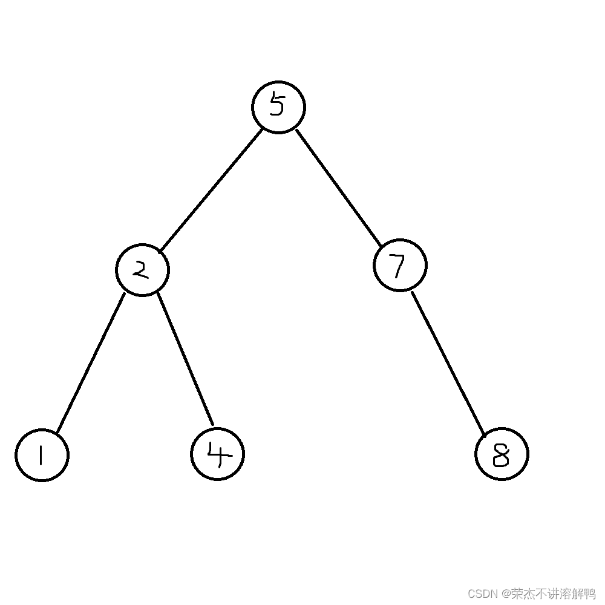

众所周知，当添加点的权值依次递增或递减时，一般 BST 将会退化成丑陋的链，such as：

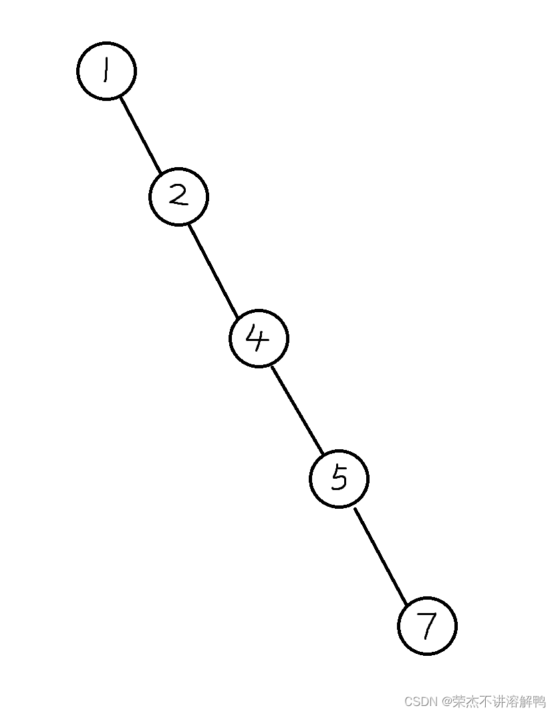

那么每次添加点的时间复杂度便能被卡成 $O(n)$，$n$ 大一点就直接 TLE，寄。

为了规避一般 BST 容易退化成链的问题，Treap 光荣产生力！

Treap 在 BST 的基础上，为每个节点赋上了（随机的）**优先值**，并在建树时时刻维护堆的性质，由于随机性，建出来的树（也是一种二叉堆）深度期望大小为 $log\ n$，因此规避了此类问题。

## 常规 Treap 的两种写法

常规 Treap 有两种写法，Splay 与 FHQ Treap：

Splay 为有旋 Treap，貌似是依靠左旋右旋节点的伸展操作来维护的 Treap，可以康康具体的图：

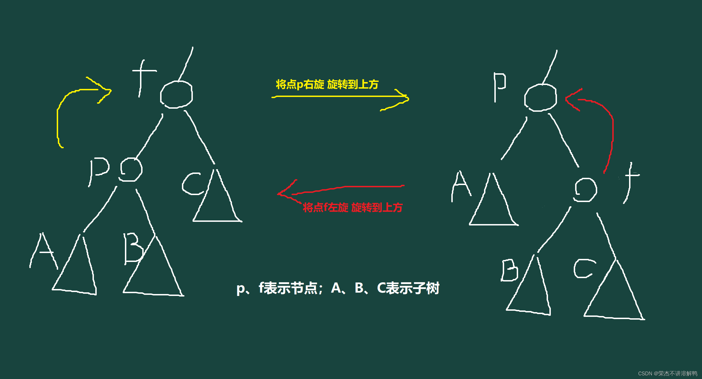

详细[戳我](https://oi-wiki.org/ds/splay/)

FHQ Treap 即无旋 Treap，与 Splay 不同，它只依靠分裂、合并能够进行添加节点、查询排名等等操作，分裂、合并如图：

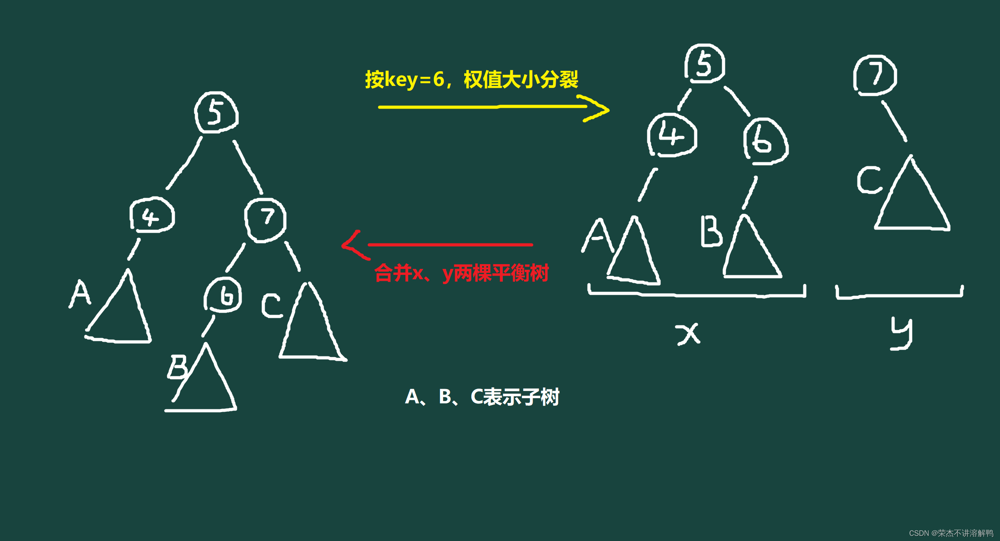

FHQ Treap 相对来说代码量较小，也更好理解，应该更适合新手学习吧？

# 正题：FHQ Treap

FHQ Treap，其中 FHQ 指此做法的发明者——范浩强神犇，是依赖于分裂合并操作实现的 Treap，这种操作方式使得它天生支持维护序列、可持久化等特性，可持久化就以后再补吧。

## 基础节点信息、建点

首先我们需要一个 $rt$ 表示树堆的根，$l$、$r$ 表示左右儿子的 $id$，还要存一个自己的权值 $key$，当前子树大小 $siz$，以及优先值 $pri$，有必要的话还要存一个 $lazy$ 标记。此外还需要一个更新节点信息的函数，当然，随机函数也可以自己手写 qwq，新建点就比较简单，代码如下：

```cpp
#define uLL unsigned long long
......
int ...rt, gs...;
uLL sd=1;
uLL rd() {
	return sd=sd*1145141ull*1145141ull;
}
struct node {
	int l, r, siz, key, lazy;
	uLL pri;
}tr[100005];
int blt(int key) {//新建点
	++gs;
	tr[gs].key=key;
	tr[gs].lazy=0;
	tr[gs].l=tr[gs].r=0; tr[gs].siz=1;
	tr[gs].pri=rd();
	return gs;
}
void upup(int now) {//更新节点信息
	tr[now].siz=tr[tr[now].l].siz+tr[tr[now].r].siz+1;
}
```

## 基础的分裂、合并

上文有说到，FHQ Treap 即无旋 Treap，要依靠分裂、合并这两种基础操作。

### 按权值分裂

分裂有两种，第一种便是上图的按权值分裂，即给定 $key$，分裂出所有点权值小于等于 $key$ 的树堆 $x$ 与所有点权值都大于 $key$ 的树堆 $y$，此分裂可以用于加点或求前驱、后继，带详解注释的代码如下：

```cpp
void fl_key(int now, int key, int& x, int& y) {
	if(!now) {//当前节点为空
		x=y=0;
		return ;
	}
    down(now);//有些题目需要用lazy标记下传，比如文艺平衡树中的区间反转操作
	if(tr[now].key <= key) {
		x=now;//权值小于等于key的添加到x树堆上，左子树一定在x树堆上
		fl_key(tr[now].r, key, tr[now].r, y);
        //再继续搜右子树，看右子树的点是添加到y树堆上（权值大于key）还是添到当前节点的右子树
	}
	else {
		y=now;//权值大于key了就添加到y树堆上，而右子树一定也在y树堆上
		fl_key(tr[now].l, key, x, tr[now].l);
        //再继续搜左子树，看左子树的点是添加到x树堆上（权值小于等于key）还是添到当前节点的左子树
	}
	upup(now);//更新节点信息
}
```

盗来的模拟代码过程的 Gif 图：

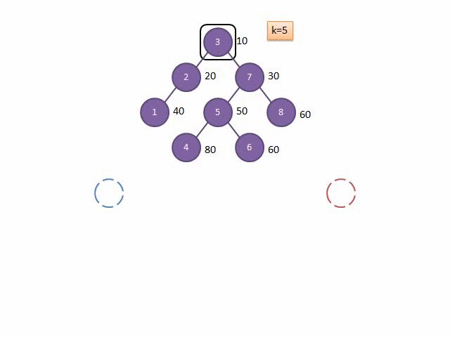

上文说过，由于随机性，我们建出来的树堆的深度期望为 $log\ n$ 层，而分裂相当于每层都只搜到了一次，所以分裂一次的时间复杂度是 $O(log_2n)$

### 按子树大小分裂

而第二种是按子树大小分裂，即给定 $siz$，优先保留左子树，分裂出大小小于等于 $siz$ 的树堆 $x$，和剩余的树堆 $y$（可能没有），如图：

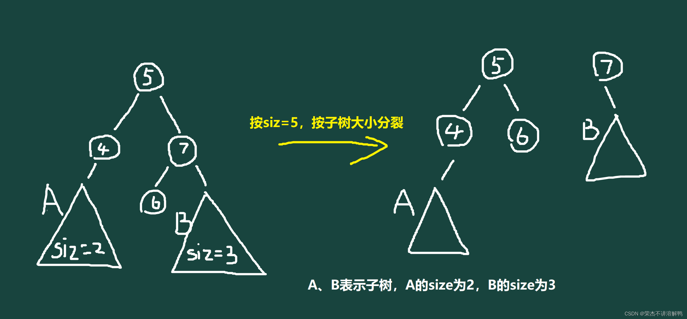

这种分裂可以用于一些特殊的操作（比如说[文艺平衡树](https://www.luogu.com.cn/problem/P3391)中的翻转区间），在普通平衡树中可用于求排名对应的值，带详解注释代码如下：

```cpp
void fl_siz(int now, int siz, int& x, int& y) {
	if(!now) {//空节点
		x=y=0;
		return ;
	}
	down(now);//有些题目需要用lazy标记下传，比如文艺平衡树中的区间反转操作
	if(tr[tr[now].l].siz+1 <= siz) {
		x=now;//左子树+自己的size小于等于siz，将左子树和自己加到树堆x上
		fl_siz(tr[now].r, siz-tr[tr[now].l].siz-1, tr[now].r, y);
        //接着搜右子树（注意！！！siz要减去左子树+当前节点的size！！！）
	}
	else {
		y=now;//不行的话就连同右子树加到树堆y上，看左子树能不能加到树堆x上
		fl_siz(tr[now].l, siz, x, tr[now].l);
	}
	upup(now);//更新节点信息
}
```

和按权值分裂的时间复杂度一样，$O(log_2n)$

### 合并

合并操作只有一种，但是要求合并的两个树堆 $x$、$y$，树堆 $x$ 的所有点的权值都要严格小于树堆 $y$ 的任意点，（但本蒟蒻还有幸遇见过答辩题要用 fhq treap 合并有交集的树堆的），而此处就要用到我们赋予的优先值啦，如图（可能看起来有点难懂）：

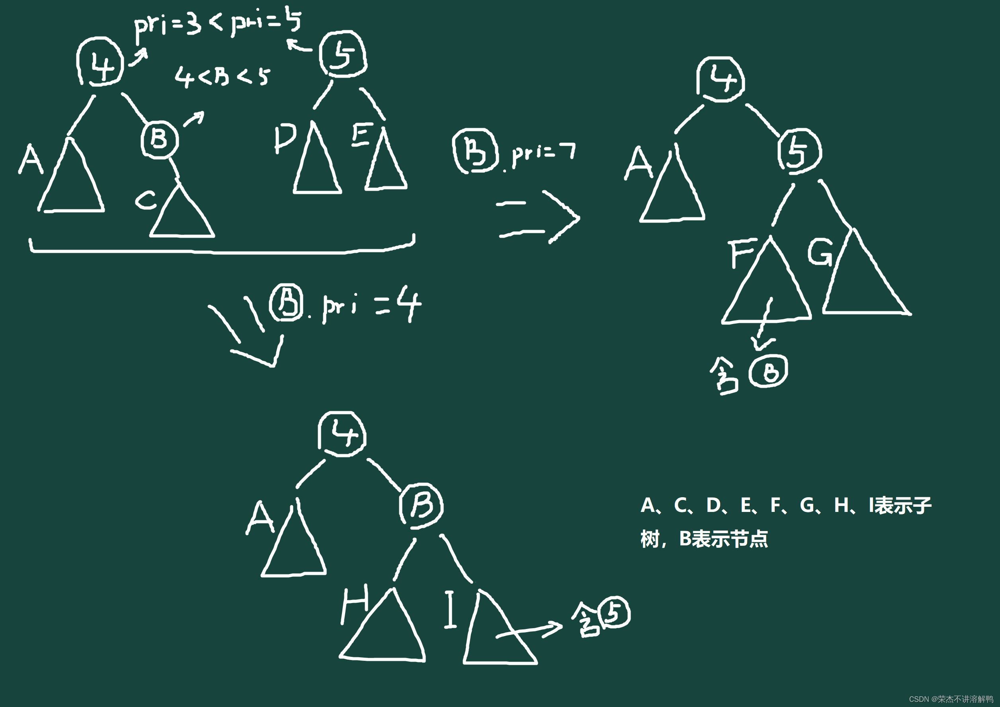

如图所示，合并时优先考虑优先值，并以优先的点为合并后的父节点，然后再将非优先点与优先点的儿子合并，这是一个递归的过程，要注意的是合并要从祖先开始，且一般合并是直接合并两个无交集的树，若是有交集那么这个合并就只能用添加点的做法（详见下文），此处直接上代码吧：

```cpp
int merge(int x, int y) {//合并时需要已经满足x的所有点的权值小于y的所有点的权值
	down(x);//有需要的话标记下传
	down(y);
	if(x == 0 || y == 0) return x+y;//x、y有一个为空节点直接返回非空的节点
	if(tr[x].pri < tr[y].pri) {//维护堆的性质，用优先值确定父亲
		tr[x].r=merge(tr[x].r, y);//y应该在x的右子树，因此要合并x的右儿子和y
		upup(x);//更新节点信息
		return x;//返回当前根节点
	}
	else {
		tr[y].l=merge(x, tr[y].l);//x应该在y的左子树，因此要合并y的左儿子和x
		upup(y);//更新节点信息
		return y;//返回当前根节点
	}
}
```

合并的话递归层数取决于树堆深度，而深度期望为 $log\ n$ 层，那么一次合并操作时间复杂度便为 $O(log_2n)$

## 添加点

既然我们已经会分裂、合并了，那么如果想要添加一个值为 $X$ 的点，我们可以直接将原树堆按 $key = X$，以权值大小分裂，然后新建点，将分裂出的树堆 $x$ 和新建点合并后再和分裂出的树堆 $y$ 合并，时间复杂度为 $O(log_2n)$，如图：

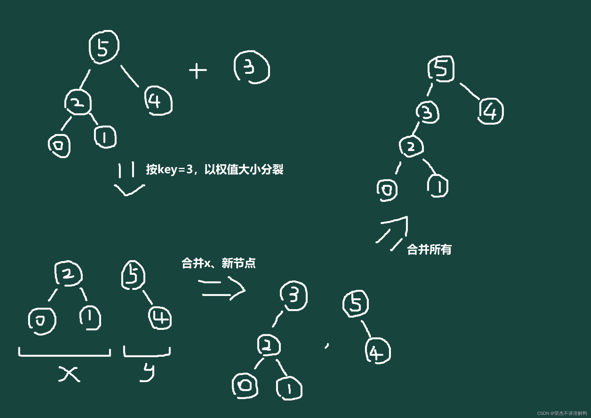

此处为什么不直接合并原树堆和新建点呢？那是因为我们写的 $merge$ 合并函数要求合并的是无交集的两树堆，且树堆 $x$ 的所有点的权值都要严格小于树堆 $y$ 的任意点，所以我们必须要先分裂再合并以保证树堆的正确性，代码如下：

```cpp
void insert(int key) {
	int x, y;
	fl_key(rt, key, x, y);
	rt=merge(merge(x, blt(key)), y);
}
```

## 删除点

删除一个值为 $X$ 的点的话可以先按 $key = X$，以权值大小分裂得到树堆 $x$、$y$，再按 $key = X-1$，以权值大小分裂树堆 $x$，得到树堆 $z$、$a$，然后将树堆 $a$ 的根节点丢掉（即合并 $a$ 的左右儿子，不合并 $a$ 的根节点，这就相当于删了一个点），所有树堆依次合并，时间复杂度依然为 $O(log_2n)$，如图：

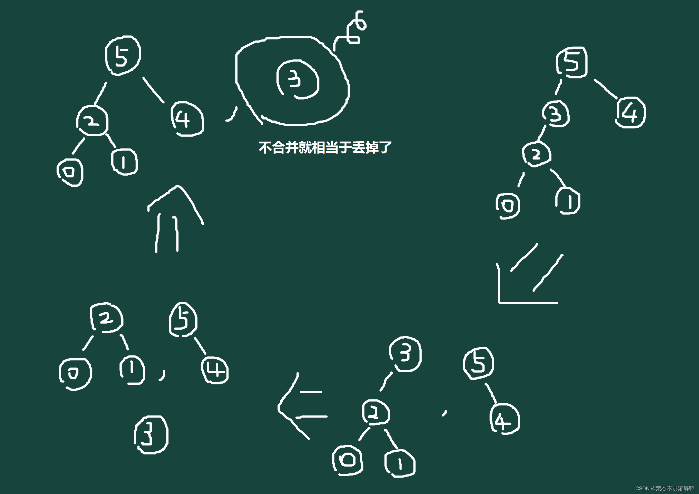

 代码如下：

```cpp
void dlt(int key) {
	int x, y, z;
	fl_key(rt, key, x, y);
	fl_key(x, key-1, z, x);
	rt=merge(merge(z, merge(tr[x].l, tr[x].r)), y);
}
```

## 查询排名

若是查询 $X$ 的排名，直接按 $key = X-1$，以权值大小分裂得到树堆 $x$、$y$，答案为树堆 $x$ 的 $size+1$，时间复杂度为 $O(log_2n)$，代码如下：（注意最后要合并回来！)

```cpp
int ask(int key) {
	int x, y, ret=0;
	fl_key(rt, key-1, x, y);
	ret=tr[x].siz+1;
	rt=merge(x, y);
	return ret;
}
```


## 查询排名对应的值

查询排名 $X$ 对应的值，有两种做法。

其一是上文提及的按子树大小分裂，按 $siz = X-1$，以子树大小分裂得到树堆 $x$、$y$，然后再按 $siz = 1$，以子树大小分裂树堆 $y$，得到树堆 $a$、$z$，$a$ 的根节点的值就是答案，时间复杂度为 $O(log_2n)$，代码如下：（注意最后都要合并回来！)

```cpp
int asks(int siz) {
	int x, y, z;
    fl_siz(rt, siz-1, x, y);
    fl_siz(y, 1, y, z);
    int ret = tr[y].key;
    rt = merge(merge(x, y), z);
    return ret;
}
```

其二是直接硬上，从根节点开始 dfs，如果左儿子+自己的 $size$ 比 $X$ 小，那么 $X$ 减去 $size$，搜右儿子，否则就搜左儿子，$X = 0$ 时就输出当前点的权值，时间复杂度依旧是 $O(log_2n)$(毕竟深度期望为 $log\ n$)，代码如下：

```cpp
int asks(int siz) {
	int o = rt;
	while(1) {
		int qwq = tr[tr[o].l].siz+1;
		if(qwq == siz) break;
		if(siz < qwq) o=tr[o].l;
		else o=tr[o].r, siz-=qwq;
	}
	return tr[o].key;
}
```

## 查询前驱、后继

查询 $X$ 的前驱，先按 $key = X-1$，以权值大小分裂得到树堆 $x$、$y$，然后从树堆 $x$ 的根节点开始，右儿子非空就一直往右边走（因为树堆 $x$ 的所有点已经满足了其点值小于等于 $X-1$，只需找到里面最大的点值），最后输出即可。

查询 $X$ 的后继，先按 $key = X$，以权值大小分裂得到树堆 $x$、$y$，然后从树堆 $y$ 的根节点开始，左儿子非空就一直往左边走（因为树堆 $y$ 的所有点已经满足了其点值大于 $X$，只需找到里面最小的点值），最后输出即可。

时间复杂度均为 $O(log_2n)$，代码：（注意最后都要合并回来！)

```cpp
int findl(int key) {
	int x, y, ret=0;
	fl_key(rt, key-1, x, y);
	ret=x;
	while(tr[ret].r != 0) ret=tr[ret].r;
	ret=tr[ret].key;
	rt=merge(x, y);
	return ret;
}
int findr(int key) {
	int x, y, ret=0;
	fl_key(rt, key, x, y);
	ret=y;
	while(tr[ret].l != 0) ret=tr[ret].l;
	ret=tr[ret].key;
	rt=merge(x, y);
	return ret;
}
```

## 普通平衡树——代码整合

总的时间复杂度大致为 $O(n\times log_2n)$，$n$ 表示操作数量。

```cpp
#include <bits/stdc++.h>
#define uLL unsigned long long
using namespace std;
int n, opt, k, gs, rt;
uLL sd=1;
uLL rd() {
	return sd=sd*1145141ull*1145141ull;
}
struct node {
	int l, r, siz, key;
	uLL pri;
}tr[100005];
int blt(int key) {
	++gs;
	tr[gs].key=key;
	tr[gs].l=tr[gs].r=0; tr[gs].siz=1;
	tr[gs].pri=rd();
	return gs;
}
void upup(int now) {
	tr[now].siz=tr[tr[now].l].siz+tr[tr[now].r].siz+1;
}
void fl_key(int now, int key, int& x, int& y) {
	if(!now) {
		x=y=0;
		return ;
	}
	if(tr[now].key <= key) {
		x=now;
		fl_key(tr[now].r, key, tr[now].r, y);
	}
	else {
		y=now;
		fl_key(tr[now].l, key, x, tr[now].l);
	}
	upup(now);
}
int merge(int x, int y) {
	if(x == 0 || y == 0) return x+y;
	if(tr[x].pri < tr[y].pri) {
		tr[x].r=merge(tr[x].r, y);
		upup(x);
		return x;
	}
	else {
		tr[y].l=merge(x, tr[y].l);
		upup(y);
		return y;
	}
}
void insert(int key) {
	int x, y;
	fl_key(rt, key, x, y);
	rt=merge(merge(x, blt(key)), y);
}
void dlt(int key) {
	int x, y, z;
	fl_key(rt, key, x, y);
	fl_key(x, key-1, z, x);
	rt=merge(merge(z, merge(tr[x].l, tr[x].r)), y);
}
int ask(int key) {
	int x, y, ret=0;
	fl_key(rt, key-1, x, y);
	ret=tr[x].siz+1;
	rt=merge(x, y);
	return ret;
}
int asks(int siz) {
	int o = rt;
	while(1) {
		int qwq = tr[tr[o].l].siz+1;
		if(qwq == siz) break;
		if(siz < qwq) o=tr[o].l;
		else o=tr[o].r, siz-=qwq;
	}
	return tr[o].key;
}
int findl(int key) {
	int x, y, ret=0;
	fl_key(rt, key-1, x, y);
	ret=x;
	while(tr[ret].r != 0) ret=tr[ret].r;
	ret=tr[ret].key;
	rt=merge(x, y);
	return ret;
}
int findr(int key) {
	int x, y, ret=0;
	fl_key(rt, key, x, y);
	ret=y;
	while(tr[ret].l != 0) ret=tr[ret].l;
	ret=tr[ret].key;
	rt=merge(x, y);
	return ret;
}
int main() {
	scanf("%d", &n);
	for(int i = 1; i <= n; ++i) {
		scanf("%d%d", &opt, &k);
		if(opt == 1) insert(k);
		else if(opt == 2) dlt(k);
		else if(opt == 3)
			printf("%d\n", ask(k));
		else if(opt == 4) 
			printf("%d\n", asks(k));
		else if(opt == 5)
			printf("%d\n", findl(k));
		else if(opt == 6)
			printf("%d\n", findr(k));
	}
	return 0;
}
```


------

## [文艺平衡树](https://www.luogu.com.cn/problem/P3391)

建议做完普通平衡树后就直接上这道题，也许能让你对平衡树的理解加深哦 qwq

### 题目简述

初始有长度为 $n$ 的 $1$、$2$、$3$……$n-1$、$n$ 的原序列，进行 $m$ 次翻转 $[l, r]$ 区间的数后，输出当前序列。

### 题解

既然题目有个平衡树，那我们直接 FHQ Treap 硬上吧！Wait Wait Wait，仔细想想，题目要求我们维护一个序列，那我们一定也要用 FHQ Treap 维护这个序列，但是他需要支持区间翻转操作，那么我们就需要将问题转化一下了 qaq。

对于每一次操作 $[l, r]$，我们先假设我们能用 FHQ Treap 分裂得到 $[l, r]$ 对应的树堆，接下来我们的问题便是区间翻转了。

假设有一个树：

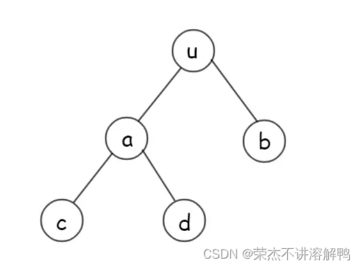

因为 Treap 是一棵二叉树，而原序列建出来的 Treap 能按中序遍历输出得到原序列，我们可以考虑最后用中序遍历输出答案。若是将图中的树中序遍历，输出为 $c-a-d-u-b$，而整个区间翻转就相当于把中序遍历给翻转了，即 $b-u-d-a-c$，我们再将新中序遍历结果对应的树画出来：

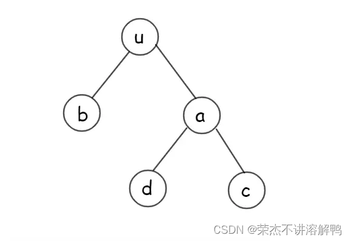

可以发现，翻转中序遍历结果相当于将树上每个点的左右儿子互换……

OMG，思路不就这么出来了，先用 FHQ Treap 分裂得到 $[l, r]$ 对应的树堆，然后翻转每个点的左右儿子，最后再合并回去，这样就 OK 啦！因为直接做翻转每个点的左右儿子会 TLE 穿，所以我们可以存一个 $lazy$ 标记，多次翻转的话就每次给标记异或上一个 $1$，在分裂、合并时下传标记即可，能够保证不会将标记传到假儿子上，时间复杂度为 $O(m\times log_2n)$

那么我们现在就只需要找到一种分裂方法能够把 $[l, r]$ 区间对应的树堆分裂出来就行了，因为有交换左右儿子的操作，那么原 Treap 就不满足二叉搜索树的性质了，我们也因此不能按权值大小分裂，否则就算使其满足了性质，也会将标记下传到假儿子上去。

此时，“按子树大小分裂”的分裂方法就能起到很大的作用了！

有一个显然的性质：对于序列的一个区间内的所有数，在该区间对应的树堆中所对应的节点也是两两相连的。这个性质就能够保证我们按子树大小分裂的正确性啦，我们可以先按 $siz = l-1$ 分裂得到树堆 $x$、$y$，然后我们再按 $siz = r-l+1$ 分裂树堆 $y$ 得到树堆 $a$、$z$，并给树堆 $a$ 打上标记，最后再合并回去，而在分裂、合并时我们再进行标记下传即可。

最后我们按中序遍历输出就是答案惹！

总时间复杂度为 $O(n \times log_2n)$ 左右，可以接受，代码如下：

```cpp
#include <bits/stdc++.h>
#define uLL unsigned long long
using namespace std;
int n, m, l, r, gs, rt;
uLL sd=1;
uLL rd() {
	return sd=sd*1145141ull*1145141ull;
}
struct node {
	int l, r, siz, key, lazy;
	uLL pri;
}tr[100005];
int blt(int key) {
	++gs;
	tr[gs].key=key;
	tr[gs].lazy=0;
	tr[gs].l=tr[gs].r=0; tr[gs].siz=1;
	tr[gs].pri=rd();
	return gs;
}
void upup(int now) {
	tr[now].siz=tr[tr[now].l].siz+tr[tr[now].r].siz+1;
}
void fl_key(int now, int key, int& x, int& y) {
	if(!now) {
		x=y=0;
		return ;
	}
	if(tr[now].key <= key) {
		x=now;
		fl_key(tr[now].r, key, tr[now].r, y);
	}
	else {
		y=now;
		fl_key(tr[now].l, key, x, tr[now].l);
	}
	upup(now);
}
void down(int now) {//lazy标记下传
	if(now == 0 || tr[now].lazy == 0) return ;
	swap(tr[now].l, tr[now].r);
	tr[tr[now].l].lazy^=1;
	tr[tr[now].r].lazy^=1;
	tr[now].lazy=0;
}
void fl_siz(int now, int siz, int& x, int& y) {//按siz分裂
	if(!now) {
		x=y=0;
		return ;
	}
	down(now);
	if(tr[tr[now].l].siz+1 <= siz) {
		x=now;
		fl_siz(tr[now].r, siz-tr[tr[now].l].siz-1, tr[now].r, y);
	}
	else {
		y=now;
		fl_siz(tr[now].l, siz, x, tr[now].l);
	}
	upup(now);
}
int merge(int x, int y) {//此时的merge已经不要求x的所有点的权值小于y的所有点的权值了，因为有交换操作，这个Treap已经无法满足二叉搜索树的性质，但是本题也不用这个性质
	down(x);
	down(y);
	if(x == 0 || y == 0) return x+y;
	if(tr[x].pri < tr[y].pri) {//相当于只是建了个堆
		tr[x].r=merge(tr[x].r, y);
		upup(x);
		return x;
	}
	else {
		tr[y].l=merge(x, tr[y].l);
		upup(y);
		return y;
	}
}
void insert(int key) {//新加点，此时的Treap满足二叉搜索树的性质
	int x, y;
	fl_key(rt, key, x, y);
	rt=merge(merge(x, blt(key)), y);
}
void change() {//进行区间翻转操作
	int x, y, z;
	fl_siz(rt, l-1, x, y);
	fl_siz(y, r-l+1, z, y);
	tr[z].lazy^=1;//打上标记
	rt=merge(merge(x, z), y);//从左往右merge，保持原siz顺序
}
void dfs(int now) {//中序遍历输出
	down(now); 
	if(tr[now].l != 0)
		dfs(tr[now].l);
	printf("%d ", tr[now].key);
	if(tr[now].r != 0)
		dfs(tr[now].r);
}
int main() {
	scanf("%d%d", &n, &m);
	for(int i = 1; i <= n; ++i)
		insert(i);
	for(int i = 1; i <= m; ++i) {
		scanf("%d%d", &l, &r);
		change();
	}
	dfs(rt);putchar('\n');
	return 0;
}
```

完结撒花~可持久化以后再来补吧